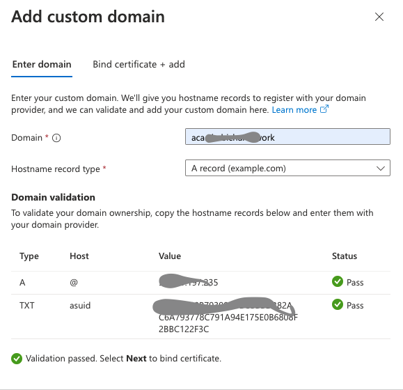

# Azure Container Appsでのカスタムドメインの設定


## 1. Azure DNS Zoneの作成

[Azure DNS ゾーンの作成](https://docs.microsoft.com/ja-jp/azure/dns/dns-operations-dnszones-portal) を参考にして、カスタムドメインで利用するドメイン名のDNS Zoneを作成。
作成後に記載されているName serverをドメインプロバイダーのネームサーばに指定する。

## 2. 証明書の準備

Acme CLI はcertbotが一番メジャーなようですが、Azure依存でいいかなということで、 Let's Encryptでの認証には、Azure Acme Cli <https://github.com/az-acme/az-acme-cli> を利用。

Azure Acme Cliでは、Azure Key Valutに登録した証明書を指定して認証局の認証を取得することができる。

### (1) Azure Key Vaultの作成
[Azure Key Vaultのクイックスタート](https://docs.microsoft.com/ja-jp/azure/key-vault/general/quick-create-portal)などを参考に、Azure Key Vaultを作成。

### (2) Azure Key VaultにSecretの登録
Azure Acme Cliのサイトに載っている手順に従って、Secretを作成。

* $KV_NAME : (1)で作成したAzure Key Vaultの名前
* $EMAIL: 自分のメールアドレス

* `--account-secret` オプションで指定した名前でAzure Key Vaultにシークレットが作成される。

```
./az-acme register \
        --key-vault-uri https://$KV_NAME.vault.azure.net/ \
        --server https://acme-v02.api.letsencrypt.org/directory \
        --account-secret reg-stg-lets-encrypt \
        --email $EMAIL \
        --agree-tos \
        --verbose
```


### (3) Azure Key Vaultで証明書の作成

Azure Key Vaultの管理画面で「Certifications」→「Generate/Import」を選択して、作成を開始。

| name | value |
|---|---|
|Method of Certificate Creation|Generate|
|Certificate Name|cert-le-stg-102|
|Type of Certificate Authority|Certificate issued by a non-integrated CA|
|Subject|CN=mydomain.com|
|DNS Names|aca.mydomain.com ←カスタムドメインとして利用するドメイン名|
|Content Type|PEM|
|その他の設定|デフォルトのまま|


### (4) Let's Encryptで認証

* $KV_NAME: Azure Key Vaultの名前
* $SUBJECT: 証明書のSubject
* $AZDNSZONE: Azure DNS ZoneのリソースID。Azure ポータル
でAzure DNS Zoneを選んで、プロパティを見ると記載されている。
こんな値
`/subscriptions/XXXXXbcc-XXXd-XdeX-XXbX-XXcXbfeXeXXX/resourceGroups/dns/providers/Microsoft.Network/dnszones/aca.mydomain.com`

* `--certificate` オプションでAzure Key Vaultに登録した証明書の名前を指定
* `--account-secret`オプションは、`az-acme register`コマンド実行時に指定したAzure Key Vaultのシークレット名

```
./az-acme order \
        --key-vault-uri https://$KV_NAME.vault.azure.net/ \
        --certificate cert-le-stg-102 \
        --server https://acme-v02.api.letsencrypt.org/directory \
        --subject $SUBJECT \
        --account-secret reg-stg-lets-encrypt \
        --dns-provider Azure \
        --azure-dns-zone $AZDNSZONE \
        --verbose
```

az-acme order コマンドで証明書の認証が完了すると、証明書一覧のCompletedカテゴリに表示される。


認証済みの証明書の詳細を見るとIssuerにLet's Encryptと記載されていることがわかる。


詳細な手順は[Azure Key Vaultの証明書の作成方法](https://docs.microsoft.com/ja-jp/azure/key-vault/certificates/create-certificate)を参照。


## 3. Azure Container Appsにカスタムドメインの設定

### (1) 証明書のダウンロード
前の手順でAzure Key Vaultに登録した証明書を PFX/PEM フォーマットでダウンロード.


### (2) カスタムドメイン設定を開始
AzureポータルでAzure Container Appの管理画面を開いて、左側のメニューから「Custom Domains」を選択。

### (3) DNS情報の確認
カスタムドメイン設定ウィザードでドメイン名を入力。
ウィザードの下の方に、Azure DNS Zoneに追加するレコードの情報が表示されるので、それをAzure DNS Zoneに追加。
追加し終わったら「Validate」ボタンで登録内容を確認。




### (4)証明書の登録
ダウンロードしておいた証明書をアップロードし、「Validate」ボタンをクリックして内容を確認。
確認がOkだったら「Add」ボタンをクリックして証明書を登録