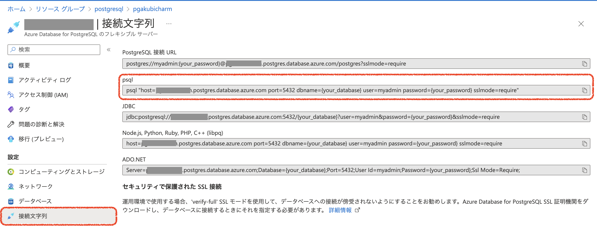

# Azure AutomateとAzure Container Instanceを使ってPostgresqlへのデータロードの実行


Azure Container Instanceは、単体でコンテナを簡単に実行することができるPaaSサービスです。
Web App For ContainersなどはWebアプリケーション用のPaaSサービスですが、Azure Container InstaneはHTTP(S)外のプロトコルでのアクセスや、バックグラウンドジョブなどにも利用することができます。

今回は、Azure Database for Postgresqlにデータをロードするためのスクリプトを実行するコンテナアプリをAzure Container Instanceにデプロイし、Azure Automateでスケジュール実行していきます。


## Azure Database for Postgresqlの準備

Azure Databadse for Postgresqlのデプロイは、[クイックスタート:Azure portalを使ってAzure Database for POstgreSQLサーバーを作成する](https://learn.microsoft.com/ja-jp/azure/postgresql/single-server/quickstart-create-server-database-portal)を参考にしてください。


psqlコマンドでの接続方法は、AzureポータルのAzure Database for Postgresqlの管理画面のメニューの設定セクションの「接続文字列」で確認することができます。




## Azure Container Instanceの準備

シンプルにPostgreSQLにテーブルを作成して、データをインサートするスクリプトを実行するだけのシンプルなコンテナイメージを作成します。

用意するファイルは以下の3つ
* ./Dockerfile
* ./tool/init.sql
* ./tool/dataLoad.sh


init.sql
```
create table if not exists todo_item (
  id serial primary key,
  description varchar(128),
  title varchar(32),
  finished boolean
);

insert into todo_item (description, title, finished) values('desc', 'title', false);
```

dataLoad.sh
``` 
#!/bin/sh
DBNAME=[DB名]
PASSWORD=[パスワード]

psql "host=pgakubicharm.postgres.database.azure.com port=5432 dbname=$DBNAME user=myadmin password=$PASSWORD sslmode=require" -f init.sql
```

Dockerfile
```
FROM alpine:latest

RUN apk --no-cache add postgresql-client
RUN mkdir /work
COPY ./tool /work/.

WORKDIR /work

CMD ["./dataLoad.sh"]
```

ファイルを準備したら、Azure Container Registoryの機能を使って、コンテナイメージをビルドしAzure Container Registryに登録します。

```
ACR_NAME=myacr
az acr build -t psql/dataload:automate -r $ACR_NAME --platform linux .
```

コンテナイメージが準備できあたら、Azure Container Instanceをデプロイします。
```
az container create \
--resource-group postgresql \
--name dataload \
--image akubicharm.azurecr.io/psql/dataload:automate 
--registry-login-server akubicharm.azurecr.io 
--registry-password XXXXX
--registry-username akubicharm
```


## Azure Automateの準備

1. Azure PortalでAutomateアカウントを選択
[images/marketplace_automate.png]
[images/automate_account_create.png]

2. 基本設定
リソースグループ、Automationアカウント名を設定します。
[images/automate_create_basic.png]


3. 詳細設定
マネージドIDを利用するにチェックします。
[images/automate_create_managedid.png]

あとは、必要に応じてネットワークの設定などをしたら「確認および作成」で入力内容を確認後、Automateアカウントを作成します。


## RunBookの作成
Automateアカウントのメニューでプロセスオートメーションのセクションから「Runbook」を選択し「+Runbookの作成」をクリックして、Runbookの作成をします。
[images/runbook_addrunbook.png]


マネージドIDでログイン後、データローダのAzure Container Instanceを実行

```
# 以前のログイン情報をこのRunbookに反映させないようにする。
Disable-AzContextAutosave –Scope Process


# Connect using a Managed Service Identity
try {
        $AzureContext = (Connect-AzAccount -Identity).context
    }
catch{
        Write-Output "There is no system-assigned user identity. Aborting."; 
        exit
    }

Start-AzContainerGroup `
		-ResourceGroupName postgresql `
		-Name dataload
```

リソースグループなどをパラメータで渡したい場合には、以下のようにスクリプトの先頭でパラメータを宣言しておけば、外部からリソースグループやACI名を設定することができます。

```
Param(
 [string]$resourceGroup,
 [string]$ACIName,
)
```

## スケジュール設定
Runbookのスケジュールで一回だけ実行や定期的な実行を設定することができます。

AutomateアカウントでRunbookを選択して、リソースセクションから「スケジュール」を選択します。
[images/runbook_schedule.png]


新しいスケジュールで実施時間や、繰り返しの指定をします。
[images/runbook_newschedule.png]


## スケジュール実行の確認
AutomateアカウントでRunbookを選択し、リソースセクションから「ジョブ」を選択します。


実行中
[images/dataload_job_running.png]

実行後
[images/dataload_job_finish.png	]


