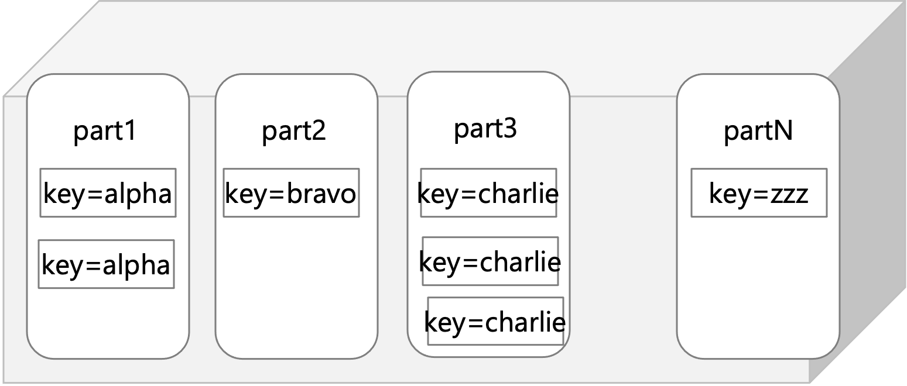

# Azure Cosmos DB

Azure Cosmos DBはフルマネージドなNoSQLデータベースです。

* ターンキーマルチリージョンデータ分散
* NoSQLのメジャーなAPIの提供と、様々なプログラミング言語に対応しているSDK
* 選択可能な5段階の一貫性モデル

など特徴があります。グローバル規模での膨大な遼のデータの読み書きにも耐えられる性能を提供します。

## 選べるAPI
内部的なデータ保持エンジンは同じなのですが、クライアントからの利用は5つのAPIから選択することができます。ただし、デプロイ時にAPIを指定するのでデプロイ後に変更をすることはできません。

* SQL(Core) API
* Cassandra API
* MongoDB API
* Gremlin API
* Table API


SQL(Core) APIは、Azure Cosmos DBネイティブなAPIで、RDBMSのSQLのようなAPIを提供します。JSONを扱うのに最適です。Table APIは、データのKey/value形式で格納しAzure Table Storageからの移行にも適しています。

Cassandra API, MongoDB API, Gremlin APIはこれらのOSS製品と互換性のあるAPIを提供しています。すでにこれらを利用している場合には、Azure Cosmos DBに移行してそのまま使うことができます。

どれを使うか迷った場合は、このフローチャートにしたがって考えてみましょう。


## 一貫性モデル


| 整合性レベル | | 保証内容|
|---|---|---|
|Strong|強固|線形化可能性。 読み取りでは、項目の最新バージョンを返すことが保証されます。|
|Bounded Staleness|一貫性のあるプレフィックス。 書き込みに対して読み取りが、最大でプレフィックス k または間隔 t だけ遅延します|
|Session|セッション|一貫性のあるプレフィックス。 単調読み取り、単調書き込み、自己の書き込みの読み取り、読み取り後の書き込み。|
|Consistent Prefix|一貫性のあるプレフィックス|返される更新が、それ以外の全更新の一部のプレフィックスとなります (ギャップなし)。|
|Eventual|最終的|読み取りは順不同です。|

詳細は公式ドキュメントを見てください。https://docs.microsoft.com/ja-jp/azure/cosmos-db/consistency-levels


## パーティション分割
Azure Cosmos DBは、パーティション分割してデータベースの個別のコンテナをスケーリングしパフォーマンスのニーズを満たします。

論理パーティションは同じパーティションキーをもつ一連のアイテムで構成されます。コンテナ内の論理パーティション数に制限はなく、各論理パーティションには最大20GBのデータを格納できます。

```
論理パーティション
同一パーティションキーのアイテムが保持される
パーティションキーの種類だけ、パーティションは作成される
パーティション数に制限はない
最大20GB / partition
```


物理パーティション間でデータとスループットを分散することでスケーリングされます。内部的には、一つまたは複数の論理パーティションが単一の物理パーティションにマッピングされます。


```
物理パーティション
物理パーティション間でデータとスループットを分散してスケール
最低1物理パーティションが必要
論理パーティション:物理パーティション= N : 1
最大　50GB / partition

```


https://docs.microsoft.com/ja-jp/azure/cosmos-db/

